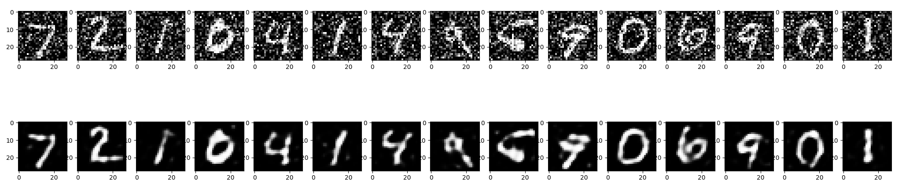

# Tensorflow Representation Learning

Use Tensorflow/Keras to build an __Autoencoder__ to perform an unsupervised learning to de-noise image files. The Autoencoder is based on a regular Keras sequential model and consists of the encoder - that is basically the same convolution layer used in regular CNNs with supervised learning - and an decoder - that is an "encoder in reverse". The decoder takes the compressed representation of the image generated by the encoder from the representation layer and has to reconstruct the initial image from this compress data:


```py
# build autoencoder model
autoencoder = tf.keras.models.Sequential()

# build the encoder CNN
autoencoder.add(tf.keras.layers.Conv2D(16, (3,3), strides=1, padding="same", input_shape=(28, 28, 1)))
autoencoder.add(tf.keras.layers.MaxPooling2D((2,2), padding="same"))

autoencoder.add(tf.keras.layers.Conv2D(8, (3,3), strides=1, padding="same"))
autoencoder.add(tf.keras.layers.MaxPooling2D((2,2), padding="same"))

# representation layer
autoencoder.add(tf.keras.layers.Conv2D(8, (3,3), strides=1, padding="same"))

# build the decoder CNN 
autoencoder.add(tf.keras.layers.UpSampling2D((2, 2)))
autoencoder.add(tf.keras.layers.Conv2DTranspose(8,(3,3), strides=1, padding="same"))

autoencoder.add(tf.keras.layers.UpSampling2D((2, 2)))
autoencoder.add(tf.keras.layers.Conv2DTranspose(1, (3,3), strides=1, activation='sigmoid', padding="same"))
```

For the training we now feed the a noisy dataset into the encoder and have the Autencoder compress and reconstruct each image. After those steps we provide to original - noise-free - image to compare the reconstructed image to. The training is complete when we reach a minimum of differences between both of them:


```py
# fit model to dataset
autoencoder.fit(X_train_noisy.reshape(-1, 28, 28, 1),          
          X_train.reshape(-1, 28, 28, 1), 
          epochs=10, 
          batch_size=200)
```

As an example, here are 15 "noised" images from the mnist digits dataset and the reconstructed de-noised image the Autoencoder generated from it:


